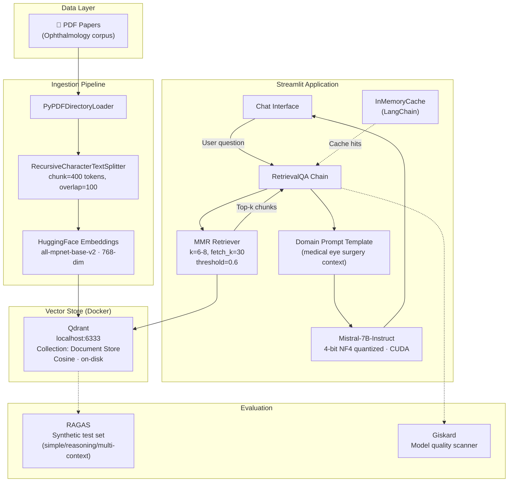
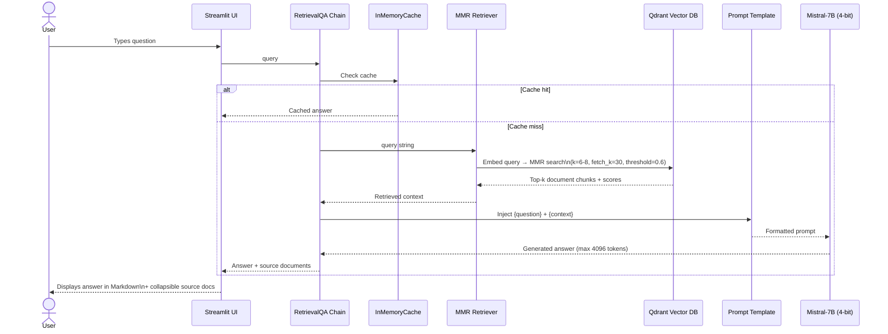
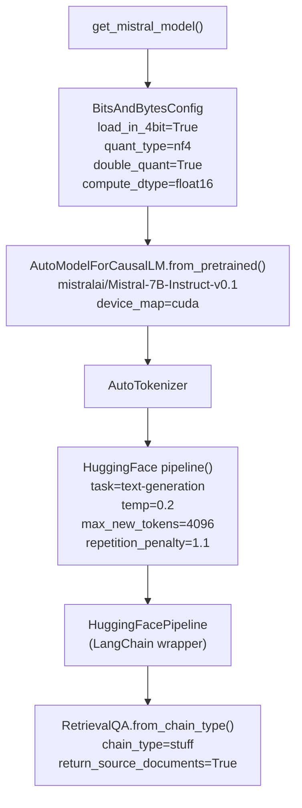
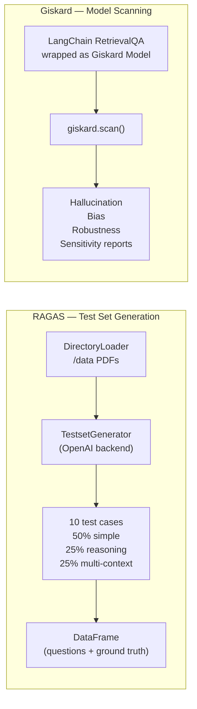

# Mistral RAG Demo — Project Documentation

## Overview

This project is a **domain-specific Retrieval-Augmented Generation (RAG) system** built for answering patient questions about **refractive eye surgery and vision correction**. A user interacts with a chat interface backed by a locally-hosted quantized LLM (Mistral-7B) that grounds its answers in a curated corpus of peer-reviewed ophthalmology papers. The system is complemented by two evaluation frameworks — **RAGAS** and **Giskard** — for measuring and scanning answer quality.

---

## What Is Being Achieved

| Goal | How |
|---|---|
| Accurate medical Q&A | LLM answers are grounded in retrieved document chunks, not open-ended generation |
| No hallucination | The prompt instructs the model to say "I'm not sure" rather than fabricate |
| Statistical richness | Prompt explicitly asks for statistical evidence from the source papers |
| Cost-efficient inference | Mistral-7B runs 4-bit quantized on a single consumer GPU (no cloud API costs) |
| Continuous knowledge updates | New PDFs dropped into the data folder are detected and ingested automatically |
| Answer quality measurement | RAGAS generates synthetic test sets; Giskard scans for failure modes |

---

## Tech Stack

| Layer | Technology | Why |
|---|---|---|
| **LLM** | `mistralai/Mistral-7B-Instruct-v0.1` | Strong instruction-following, open-weights, fits quantized on one GPU |
| **Quantization** | BitsAndBytes (NF4, 4-bit, double quant) | Reduces VRAM from ~14 GB to ~5 GB with negligible quality loss |
| **Embeddings** | `sentence-transformers/all-mpnet-base-v2` | High-quality 768-dim dense vectors, runs fully local |
| **Vector DB** | Qdrant (Docker) | High-performance ANN search, MMR support, on-disk payload for large corpora |
| **Orchestration** | LangChain 0.0.312 | Chains retriever + LLM, manages prompt templates, caching |
| **UI** | Streamlit | Rapid chat interface with session state and sidebar settings |
| **PDF Ingestion** | LangChain `PyPDFDirectoryLoader` + `RecursiveCharacterTextSplitter` | Handles multi-page PDFs, recursive splitting preserves semantic boundaries |
| **Evaluation — Metrics** | RAGAS | Generates synthetic Q&A test sets to measure faithfulness, relevancy, etc. |
| **Evaluation — Scanning** | Giskard | Automated model scanning for hallucination, bias, robustness failures |
| **Infrastructure** | Docker Compose | Isolated, reproducible Qdrant deployment |
| **GPU Runtime** | PyTorch + CUDA | Required for quantized model inference |
| **GPU** | NVIDIA GeForce RTX 5060 Ti (16 GB VRAM) | Runs Mistral-7B at 4-bit quant (~5 GB VRAM used) |

---

## Architecture

### High-Level System Diagram



---

### Document Ingestion Pipeline

```mermaid
flowchart LR
    A["📁 /data folder\n.pdf files"] -->|glob scan| B["docs_to_add()\nDetect new files"]
    B --> C["PyPDFDirectoryLoader\nLoad all pages"]
    C --> D["RecursiveCharacterTextSplitter\nchunk_size=400\nchunk_overlap=100"]
    D --> E["get_HFembedding()\nall-mpnet-base-v2\nCUDA device"]
    E -->|768-dim vectors| F["QdrantCollection.upsert_collection()\nUUID point IDs\nCosine distance"]
    F --> G[("Qdrant\nDocument Store")]
    G -->|mmap_threshold=20000\non_disk=True| H["Optimized\non-disk storage"]
```



---

### Query Processing Pipeline



---

### LLM Initialization



---

### Evaluation Framework



---

## Module Reference

```
mistral-demo/
├── RAG/                          # Core application
│   ├── streamlit_app.py          # Chat UI, session state, sidebar settings
│   ├── llm.py                    # LLM loading, RetrievalQA chain setup
│   ├── prompts.py                # Medical domain system prompt
│   ├── docker-compose.yaml       # Qdrant container definition
│   ├── requirements.txt          # Python dependencies
│   ├── pyproject.toml            # Project metadata
│   │
│   ├── embed/
│   │   ├── embed_pdf.py          # get_HFembedding() — HuggingFace embedding factory
│   │   └── vectorstore.py        # QdrantCollection class — collection CRUD + upsert
│   │
│   ├── ingest/
│   │   └── ingest_pdf.py         # PDF loading, chunking, folder diff tracking
│   │
│   ├── app/
│   │   ├── cache.py              # LangChain cache configuration (InMemoryCache)
│   │   └── prompts.py            # Alternative generic prompt template
│   │
│   └── retrievers/
│       └── multiqueryretriever.py  # MultiQueryRetriever (prepared, currently disabled)
│
├── RAGAS/
│   ├── testquestiongenerator.py  # Synthetic test set generation
│   └── requirements.txt
│
├── giskard/
│   └── eval.py                   # Giskard model scan scaffolding
│
└── data/                         # Ophthalmology PDF corpus (25+ papers)
```

---

## Configuration Reference

### Retrieval

| Parameter | Value | Effect |
|---|---|---|
| `search_type` | `mmr` | Maximal Marginal Relevance — balances relevance and diversity of retrieved chunks |
| `k` | 6–8 | Number of chunks returned to the LLM |
| `fetch_k` | 30 | Candidate pool size before MMR re-ranking |
| `score_threshold` | 0.6 | Minimum cosine similarity; filters low-relevance chunks |

### Chunking

| Parameter | Value |
|---|---|
| `chunk_size` | 400 tokens |
| `chunk_overlap` | 100 tokens |
| `splitter` | `RecursiveCharacterTextSplitter` |

### LLM (Mistral-7B)

| Parameter | Value |
|---|---|
| `temperature` | 0.2 |
| `max_new_tokens` | 4096 |
| `repetition_penalty` | 1.1 |
| `quantization` | NF4, 4-bit, double quantization |
| `compute_dtype` | `float16` |
| `device` | CUDA |

### Qdrant

| Parameter | Value |
|---|---|
| `host` | `localhost:6333` |
| `collection` | `Document Store` |
| `vector_size` | 768 |
| `distance` | Cosine |
| `on_disk` | `True` (vectors + payload) |
| `memmap_threshold` | 20,000 |
| `grpc_port` | 6334 |

---

## Getting Started

> **Hardware used:** NVIDIA GeForce RTX 5060 Ti · 16 GB VRAM · Driver 580.105.08
> The 4-bit quantized model uses ~5 GB VRAM, leaving headroom for larger corpora and longer contexts.

### 1. Start the Vector Database

```bash
cd RAG/
docker compose up -d
```

This starts Qdrant at `http://localhost:6333`. The dashboard is available at `http://localhost:6333/dashboard`.

### 2. Install Dependencies

```bash
pip install -r RAG/requirements.txt
```

> A CUDA-capable GPU is required for running the quantized Mistral-7B model.

### 3. Add Documents

Place PDF files into the `data/` directory. The application detects new files on startup and ingests them automatically.

### 4. Run the Application

```bash
cd RAG/
streamlit run streamlit_app.py
```

### 5. (Optional) Generate an Evaluation Test Set

```bash
cd RAGAS/
pip install -r requirements.txt
# Requires OPENAI_API_KEY in environment
python testquestiongenerator.py
```

---

## Design Decisions

**Why MMR instead of plain similarity search?**
Medical papers often contain highly similar passages. MMR re-ranks retrieved chunks to maximize diversity, ensuring the LLM receives complementary context rather than redundant excerpts.

**Why 4-bit quantization?**
Mistral-7B at full precision requires ~14 GB of VRAM. NF4 double quantization reduces this to ~5 GB with negligible perplexity degradation, making it practical on a single consumer GPU.

**Why Qdrant over FAISS/Chroma?**
Qdrant supports on-disk storage with mmap optimization, making it suitable for large corpora that exceed GPU/CPU memory. It also provides a REST API and dashboard out of the box, and is production-ready.

**Why a domain-specific prompt?**
The prompt constrains the model to the refractive surgery domain, instructs it to cite statistics, and provides a safe fallback ("I'm not sure") to prevent hallucination on out-of-scope questions.

**Why two evaluation frameworks?**
RAGAS measures *what* the RAG pipeline produces (faithfulness, answer relevancy, context precision) using synthetic ground truth. Giskard scans *how* the model behaves under adversarial and edge-case inputs. Together they cover both metric-driven and behavioral evaluation.
